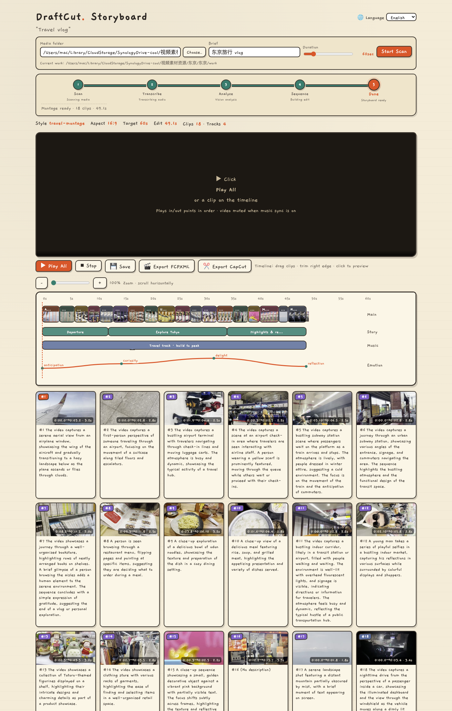

# DraftCut

An **AI skill** for turning a folder of footage into an editable cut plan—plus the scripts and web storyboard the skill runs.

**[English](#english)** · **[中文](#中文)**

---

## English

**DraftCut is an AI skill, not a standalone app.** The skill lives in `SKILL.md`: it teaches an AI agent how to be your editing assistant—scan a folder, understand clips, pick a style, build a sequence, open a storyboard for tweaks, export to CapCut or FCPXML. **`scripts/`** and the web UI are tools the skill calls. You *can* run them by hand; the intended flow is: **tell the AI your folder + brief, let the skill run the pipeline.**

Works in **Cursor** and any agent that loads skills (same idea as other AI coding / assistant skills).

Does **not** render a final MP4—delivers a plan you finish in Premiere, Final Cut, Resolve, or CapCut.

### What it's for

- **Raw footage, no edit yet** — travel, vlog, food, product; the AI reads content and proposes a cut
- **Speech + visuals** — transcription + vision so the AI knows what is said and shown
- **Finish in a real NLE** — `montage.json`, storyboard, FCPXML / CapCut draft

### What you get

| Piece | Role |
|-------|------|
| `SKILL.md` | **The AI skill** — stages, rules, when to ask you |
| `work/shots.json` | Scan (up to 20 frames per asset) |
| `work/analysis.json` | AI titles, summaries, beats, highlights |
| `work/montage.json` | Edit plan (source of truth) |
| Web storyboard | Preview, drag, trim, save, export |

Pipeline: `Scan → Transcribe → Analyze → Sequence → Done`
